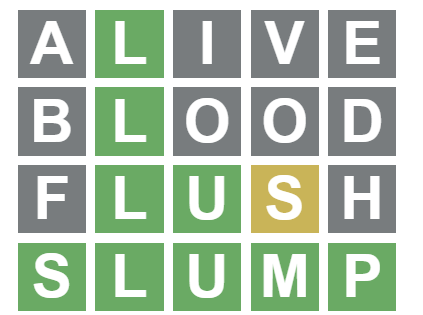

```{r setup, include=FALSE}
knitr::opts_chunk$set(echo = TRUE)
```


This is my approach to solving/cheating at [Wordle](https://www.powerlanguage.co.uk/wordle/).


### Package(s)

First, get the {tidyverse} loaded:

```{r warning=FALSE}
library(tidyverse)
```

### Words

We'll need a dictionary. I wanted word frequencies too. After not being satisfied with dictionaries built into CRAN packages, my wanders around the web led me to [Wiktionary](https://en.wiktionary.org/)'s page on [frequency lists](https://en.wiktionary.org/wiki/Wiktionary:Frequency_lists#English). I (arbitrarily) opted for a [dataset](https://github.com/hermitdave/FrequencyWords/) developed by analysing an open subtitle corpus.

Let's grab it directly from the GitHub repo:

```{r}
words <-
  read.csv(
    "https://raw.githubusercontent.com/hermitdave/FrequencyWords/master/content/2018/en/en_full.txt",
    sep = " ",
    header = FALSE
  )
names(words) <- c("word", "freq")
```

And take a look:

```{r}
head(words, 10)
```

Next, filter to only words of length 5 and tidy a little to remove words with apostrophes, etc.

```{r}
wordles <- words %>%
  filter(str_length(word) == 5) %>%
  mutate(word = str_to_lower(word)) %>%
  filter(str_detect(word, "^[a-z]*$")) %>%
  arrange(desc(freq))
```

(The word list was already reverse sorted by frequency, but I've sorted again in case I slot in another word list later.)


```{r}
head(wordles, 10)
```

That looks better, though I'm not sure all those words are gonna to be a wordle. In retrospect a subtitle corpus wasn't ideal. Anyway, onwards...


### Helpers

Tidyverse and base R already have everything I need to filter this word list. I just want some helper functions to make them easier to use.

#### All words that have particular letters somewhere

```{r}
all_lets_somewhere <- Vectorize(function(str, lets) {
  all(str_detect(str, strsplit(lets, "")[[1]]))
}, vectorize.args = "str")
```

Here's how it works:

```{r}
all_lets_somewhere(c("lovely", "weather"), "e")
```

```{r}
all_lets_somewhere(c("lovely", "weather"), "ew")
```


#### All words that don't have particular letters anywhere

```{r}
no_lets_anywhere <- Vectorize(function(str, lets) {
  !any(str_detect(str, strsplit(lets, "")[[1]]))
}, vectorize.args = "str")
```

Here's how it works:

```{r}
no_lets_anywhere(c("zebra", "giraffe"), "zb")
```


#### Filter/keep words with letters in particular positions

Wordle's feedback can tell us that a letter is there somewhere but not in the position we guessed. {str_detect} already does what we need easily enough: a "." in a regex matches any letter, so we can easily negate that. This is a wrapper for ease of piping:

```{r}
ditch_pattern <- function(data, match) {
  data %>%
    filter(!str_detect(word, match))
}
```

Here's how to use it. First, here's the top of the wordles data:

```{r}
wordles %>%
  head()
```

Let's remove the two words with "in" in their third and fourth characters:

```{r}
wordles %>% 
  head() %>%
  ditch_pattern("..in.")
```

{keep_pattern} works similarly:

```{r}
keep_pattern <- function(data, match) {
  data %>%
    filter(str_detect(word, match))
}
```

Here's an example:

```{r}
wordles %>% 
  head() %>%
  keep_pattern("..in.")
```

#### Final filter helpers

These just make it easier to use functions above in a pipe:

```{r}
ditch_letters <- function(data, match) {
  data %>%
    filter(no_lets_anywhere(word, match))
}

keep_letters <- function(data, match) {
  data %>%
    filter(all_lets_somewhere(word, match))
}
```


### Test drive

Let's give it a go. These examples use a wordle from a few days ago, so hopefully no spoilers!

To get started, let's use the most frequent word with a handful of vowels:

```{r}
wordles %>%
  keep_letters("aie") %>%
  head()
```

We have one hit!


{width=200px}


So we want to keep all words with "l" in the second character and ditch the others:

```{r}
wordles %>%
  keep_pattern(".l...") %>%
  ditch_letters("aive") %>%
  head()
```

I'll just go for the most frequent word in the remaining data.


{width=200px}

No new matches! But we can ditch three more letters.

```{r}
wordles %>%
  keep_pattern(".l...") %>%
  ditch_letters("aivebod") %>%
  head()
```

Let's go for the most frequent word again:


{width=200px}

More matches. Let's filter some more. I have also removed words ending "s" as it seems unlikely wordles would just be plurals, and the top matches ending "s" weren't singular nouns (like the four letter one, "news").

```{r}
wordles %>%
  keep_pattern(".lu..") %>%
  ditch_letters("aivebodfh") %>%
  keep_letters("s") %>%
  ditch_pattern("...s.") %>%
  ditch_pattern("....s") %>%
  head()
```

Again, let's go for the most frequent match:


{width=200px}

And we're done.

