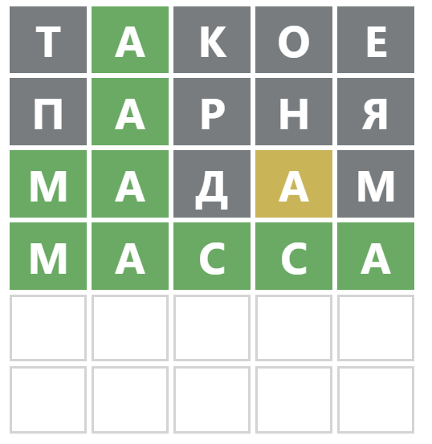

```{r setup, include=TRUE}
knitr::opts_chunk$set(echo = TRUE)
```


This is my approach to solving/cheating at the [Russian Wordle](https://wordle.belousov.one/), mildly editing my English one over [there](https://inductivestep.github.io/wordle/).


### Package(s)

First, get the {tidyverse} loaded:

```{r}
library(tidyverse)
```

Check that the basics are working:

```{r}
str_detect("когда", "..гд.")
```
```{r}
tolower("КОГДА")
```

### Words

I'm using the Russian version of the word list previously discussed over [here](https://inductivestep.github.io/wordle/), directly from the GitHub repo:

```{r}
words <-
  read.csv(
    "https://raw.githubusercontent.com/hermitdave/FrequencyWords/master/content/2016/ru/ru_full.txt",
    sep = " ",
    encoding="UTF-8",
    header = FALSE
  ) %>%
  as_tibble()
names(words) <- c("word", "freq")
```


```{r}
head(words)
```

The words don't display properly; however, printing the vector works okay:

```{r}
head(words) %>%
  pull(word)
```

Make the wordles as before:

```{r}
wordles <- words %>%
  filter(str_length(word) == 5) %>%
  mutate(word = str_to_lower(word)) %>%
  arrange(desc(freq))
```

```{r}
wordles %>%
  slice_head(n = 500) %>%
  slice_sample(n = 5) %>%
  pull(word)
```


### Helpers

Tidyverse and base R already have all the functions I need to filter this word list as we learn more about what letters are and are not in a wordle. I just want some helper functions to make them easier to use.


#### All words that have particular letters somewhere

```{r}
all_lets_somewhere <- Vectorize(function(str, lets) {
  all(str_detect(str, strsplit(lets, "")[[1]]))
}, vectorize.args = "str")
```

Here's how it works -- test whether "о" is in each word:

```{r}
all_lets_somewhere(c("очень", "когда"), "о")
```

Test whether "о" and "ч" are in each word:

```{r}
all_lets_somewhere(c("очень", "когда"), "оч")
```


#### All words that don't have particular letters anywhere

```{r}
no_lets_anywhere <- Vectorize(function(str, lets) {
  !any(str_detect(str, strsplit(lets, "")[[1]]))
}, vectorize.args = "str")
```

Here's how it works -- test whether neither "д" nor "а" are in each word:

```{r}
no_lets_anywhere(c("очень", "когда"), "да")
```


#### Filter/keep words with letters in particular positions

Wordle's feedback can tell us that a letter is there somewhere but not in the position we guessed. `str_detect` already does what we need easily enough: a "." in a [regex](https://en.wikipedia.org/wiki/Regular_expression) matches any letter, so we can negate that. This is a wrapper for ease of piping:

```{r}
ditch_pattern <- function(data, match) {
  data %>%
    filter(!str_detect(word, match))
}
```


Here's how to use it. First, here's the top of the wordles data:

```{r}
wordles %>%
  head() %>%
  pull(word)
```


Let's remove the word with "гд" in their third and fourth characters:


```{r}
wordles %>% 
  head() %>%
  ditch_pattern("..гд.") %>%
  pull(word)
```


`keep_pattern` works similarly:

```{r}
keep_pattern <- function(data, match) {
  data %>%
    filter(str_detect(word, match))
}
```

Here's an example:

```{r}
wordles %>% 
  head() %>%
  keep_pattern("..гд.") %>%
  pull(word)
```


#### Final filter helpers

These functions just make it easier to use functions above in a pipe:

```{r}
ditch_letters <- function(data, match) {
  data %>%
    filter(no_lets_anywhere(word, match))
}

keep_letters <- function(data, match) {
  data %>%
    filter(all_lets_somewhere(word, match))
}
```


### Letter frequencies

```{r}
long_wordles <- function(wordles) {
  wordle_chars <- sapply(str_split(wordles$word, ""),
                         c) %>% 
  t()
  
  colnames(wordle_chars) <- paste("c", 1:5, sep = "_")
  
  bind_cols(wordles, wordle_chars %>% as_tibble()) %>%
  pivot_longer(cols = c_1:c_5,
               names_prefix = "c_",
               names_to = "pos",
               values_to = "let")
}
```

```{r}
letter_freqs <- function(wordles) {
  n_words <- nrow(wordles)
  
  wordles %>%
    long_wordles() %>%
    group_by(word, freq, let) %>%
    summarise(n = n()) %>%
    mutate(b = as.numeric(n > 0)) %>%
    ungroup() %>%
    group_by(let) %>%
    summarise(n = n()) %>%
    ungroup() %>%
    mutate(perc = 100*n/n_words) %>%
    arrange(desc(n))    
}
```

Get letter frequencies for 1000 most frequent words:

```{r}
wordles %>%
  head(1000) %>%
  letter_freqs() %>%
  pull(let)
```

The most frequent letters are "о", "а", "е", "и", and "т". Let's find a word with as many as possible of those letters...

```{r}
wordles %>%
  keep_letters("оае") %>%
  head() %>%
  pull(word)
```

I'll spare you all the steps - this was the final one:

```{r}
wordles %>%
  keep_letters("ам") %>%
  keep_pattern("ма...") %>%
  ditch_letters("ткоепрняд") %>%
  ditch_pattern("...а.") %>%
  pull(word)
```

Here's the route I took:

{width=200px}

